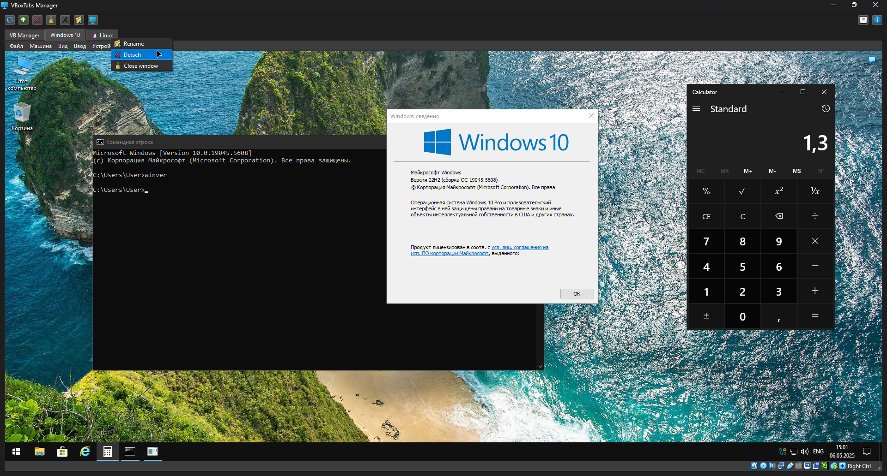

# VBoxTabs Manager

[](https://github.com/Zalexanninev15/VBoxTabs-Manager)
[](https://pypi.org/project/PySide6/)
[](https://www.python.org/)
[](https://github.com/Zalexanninev15/VBoxTabs-Manager/releases/latest)
[](https://github.com/Zalexanninev15/VBoxTabs-Manager/releases)
[](https://github.com/Zalexanninev15/VBoxTabs-Manager/commits/main)
[](https://github.com/Zalexanninev15/VBoxTabs-Manager/stargazers)
[](https://github.com/Zalexanninev15/VBoxTabs-Manager/network/members)
[](https://github.com/Zalexanninev15/VBoxTabs-Manager/issues?q=is%3Aopen+is%3Aissue)
[](https://github.com/Zalexanninev15/VBoxTabs-Manager/issues?q=is%3Aissue+is%3Aclosed)
[](LICENSE)
[](https://z15.neocities.org/donate)

## Screenshot



## Description

**VBoxTabs Manager** is a Python application that allows you to gather all running VirtualBox virtual machines into a single window with tabs. All elements and functionality of VirtualBox windows are fully preserved.

## Features

- Automatic detection of running VirtualBox virtual machines
- Combining windows into tabs with the ability to switch between them
- Tab renaming capability
- Theme selection for the application
- Detaching virtual machines back to separate windows
- Automatic refresh of available virtual machines list
- Context menu for each tab (right-click)
- Drag & drop to reorder tabs or detach by dragging out
- Full support for both English and Russian "[Running]" window titles

## Requirements

- Windows 10 or Windows 11
- VirtualBox 7.0 or higher (may work on lower versions, but not tested)
- No dependencies required for the standalone build (see below for running from source)

## Installation and Usage

### 1. Using the Release (Recommended)

- Download the latest ready-to-use EXE from the [releases page](https://github.com/Zalexanninev15/VBoxTabs-Manager/releases/latest).
- Run `VBoxTabsManager.exe` — **no installation or dependencies required**.

### 2. Running from Source

1. Install Python 3.12+ (maybe, 3.8+).
2. Install dependencies:

    ```batch
    pip install -r requirements.txt
    ```

3. Download or clone this repository.
4. Start the required virtual machines in VirtualBox.
5. Run the application:

    ```batch
    python VBoxTabs-Manager.py
    ```

All detected running virtual machines will be added to the tabs.

### Tab Actions

- **Switch between virtual machines**: simply click on the corresponding tab
- **Detach a virtual machine**: click on the X on the tab, use the detach button in the toolbar, or right-click the tab and select "Detach"
- **Attach all available VMs**: use the attach button in the toolbar
- **Refresh the list of virtual machines**: click the refresh button in the toolbar
- **Rename a tab**: click the rename button in the toolbar or use the context menu
- **Change application theme**: select a theme from the dropdown in the toolbar
- **Context menu**: right-click any tab for quick actions (rename, detach, close). Opening the context menu while holding down the **Ctrl** key allows you to interact with the context menu of an inactive tab without switching to it.

When closing the application, all virtual machines are automatically detached back to separate windows.

## How It Works

The application uses the Win32 API (via pywin32) to:
1. Find VirtualBox windows with running virtual machines
2. Change window styles to embed them as child windows in Qt widgets
3. Manage the size and position of windows within tabs

Qt6 (PySide6) is used to create a tabbed user interface and manage the application.

## Troubleshooting

- **Virtual machine is not detected**: make sure the virtual machine is running and has "[Running]" or "[Работает]" in the title
- **Problems displaying window content**: try resizing the main application window
- **Problems with detaching windows**: restart the application and try again

## Building a Standalone EXE

A GitHub Action is provided to automatically build a standalone Windows x64 executable (no dependencies required) on every commit that changes `VBoxTabs-Manager.py`. The resulting build is published as a release with the version taken from the application.

To build manually, you can use [PyInstaller](https://pyinstaller.org/):

```batch
pip install pyinstaller
pyinstaller --onefile --windowed --noconfirm --name VBoxTabs-Manager --hidden-import=PySide6.QtCore --hidden-import=PySide6.QtGui --hidden-import=PySide6.QtWidgets --hidden-import=PySide6.QtNetwork --hidden-import=PySide6.QtPrintSupport --hidden-import=PySide6.QtSvg --hidden-import=PySide6.QtOpenGL --hidden-import=win32api --hidden-import=win32con --hidden-import=win32gui --hidden-import=win32process --hidden-import=win32com VBoxTabs-Manager.py
```

## License

This project is licensed under the MIT License. See [LICENSE](LICENSE) for details.
